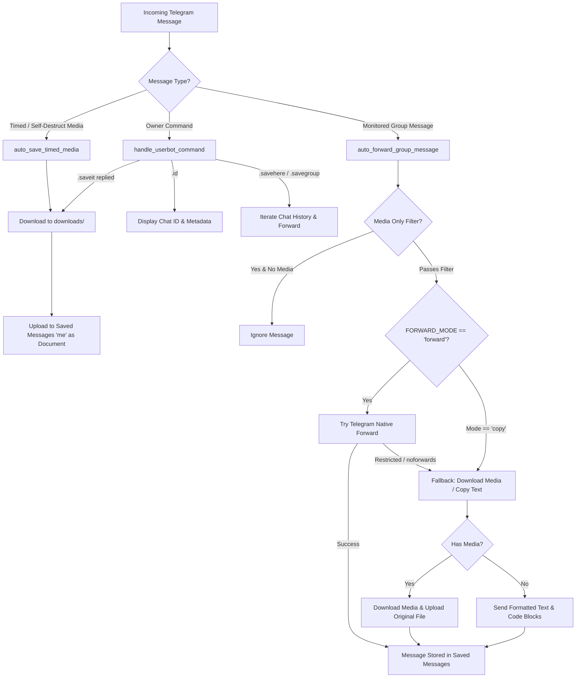

# Saveit - Telegram Timed Media Saver & Group Tutorial Forwarder

Saveit is an automated Telegram userbot built with [Telethon](https://docs.telethon.dev/). It is designed to automatically preserve timed (self-destructing) media and auto-forward programming tutorials, study materials, code snippets, videos, and documents from Telegram groups or channels directly into your **Saved Messages** as original, uncompressed files.

---

## Key Features

* **Automatic Timed Media Saver**: Intercepts and downloads disappearing/self-destructing photos, videos, voice notes, and video notes immediately upon arrival.
* **Group & Channel Tutorial Forwarder**: Automatically listens to designated groups and channels (e.g., programming tutorial groups where owners allowed saving) and forwards/saves lessons directly to your Saved Messages (`"me"`).
* **Restricted Content Fallback**: If a group has "Restrict saving content" (`noforwards`) enabled, Saveit automatically detects this and falls back to downloading the media and re-uploading it as an original file with tutorial captions intact.
* **Historical Backfill / Catch-Up**: Easily backfill past tutorial messages upon bot startup (`BACKFILL_LIMIT` / `--backfill`) or on-demand via in-chat commands.
* **Chat Discovery CLI**: Quickly list all joined channels and groups along with their numeric Chat IDs and usernames via `python3 Saveit.py --list-chats`.
* **Original Quality Preservation**: Uploads media files using Telegram's document mode (`FORCE_DOCUMENT=true`) to avoid video/image re-compression.
* **Persistent SQLite Duplicate Tracker**: Tracks message IDs, Telegram file IDs (`document.id`/`photo.id`), and binary SHA-256 hashes in a local SQLite database (`saveit_tracker.db`). Survives restarts and skips duplicates even if files are renamed or reposted.
* **In-Chat Userbot Commands**: Control saving, query chat IDs, view storage stats (`.stats`), adjust rate limits (`.rate`), and batch save messages directly from Telegram chats using your account.
* **Adaptive Rate Limiting & FloodWait Protection**: Throttles outgoing forward and upload operations (`RATE_LIMIT_DELAY=1.5s`) to comply with Telegram limits. Automatically pauses and retries on `FloodWaitError` without dropping messages.

---

## Table of Contents

- [Requirements](#requirements)
- [Quick Start](#quick-start)
- [Telegram API Credentials](#telegram-api-credentials)
- [Configuration Reference (.env)](#configuration-reference-env)
- [Command Line Interface (CLI)](#command-line-interface-cli)
- [Finding Group & Channel IDs](#finding-group--channel-ids)
- [In-Chat Userbot Commands](#in-chat-userbot-commands)
- [Architecture & Processing Flow](#architecture--processing-flow)
- [Troubleshooting & FAQ](#troubleshooting--faq)
- [Ethical & Educational Notice](#ethical--educational-notice)
- [License & Donations](#license--donations)

---

## Requirements

* **Python 3.9+**
* Telegram Account & API Credentials (`API_ID` and `API_HASH`)
* Python packages:
  * `telethon`
  * `python-dotenv`

Install dependencies manually:

```bash
pip install --upgrade telethon python-dotenv
```

---

## Quick Start

### 1. Clone the Repository

```bash
git clone https://github.com/DevURANIUM/Saveit.git
cd Saveit
```

### 2. Run the Interactive Setup Script

On **Linux / macOS**:

```bash
chmod +x run.sh
./run.sh
```

On **Windows**:

```bat
run.bat
```

The script will automatically:
1. Create `.env` from `.env.example` if it does not exist.
2. Prompt for your Telegram `API_ID`, `API_HASH`, command prefix, and optional `FORWARD_GROUP_IDS`.
3. Install or update required Python libraries.
4. Launch `Saveit.py`.

---

## Telegram API Credentials

To use Telethon, you must generate your own Telegram API credentials:

1. Log into [my.telegram.org](https://my.telegram.org) with your Telegram phone number.
2. Navigate to **API development tools**.
3. Create an application (you can name it `Saveit`).
4. Copy your `api_id` and `api_hash`.
5. Paste them into your `.env` file.

---

## Configuration Reference (.env)

All settings can be configured in `.env`. Here is the full list of supported parameters:

| Parameter | Type | Default | Description |
| :--- | :--- | :--- | :--- |
| `API_ID` | Integer | *Required* | Your Telegram API ID from [my.telegram.org](https://my.telegram.org). |
| `API_HASH` | String | *Required* | Your Telegram API Hash from [my.telegram.org](https://my.telegram.org). |
| `HANDLER` | String | `.saveit` | Prefix for userbot commands in Telegram. |
| `AUTO_SAVE_TIMED` | Boolean | `true` | Automatically downloads and saves incoming disappearing media. |
| `FORWARD_GROUP_IDS` | String | *Empty* | Comma-separated list of group/channel IDs or usernames to monitor (e.g. `-1001234567890, @python_tutorials`). Aliases: `FORWARD_GROUPS`, `FORWARD_CHATS`, `WATCH_GROUPS`. |
| `FORWARD_MEDIA_ONLY` | Boolean | `false` | If `true`, only forwards messages containing media. If `false`, forwards all content including text tutorials and code blocks. |
| `FORWARD_MODE` | String | `forward` | `forward`: Native Telegram forward with auto-fallback to download/upload if restricted. `copy`: Always download and re-upload directly. |
| `BACKFILL_LIMIT` | Integer / String | `0` | Number of recent messages (e.g. `50`) or `'all'` to backfill from the very beginning of monitored groups on startup (`0` = disabled, listens only for new messages). |
| `FORCE_DOCUMENT` | Boolean | `true` | Sends files as uncompressed documents to maintain 100% original quality. |
| `CLEANUP_DOWNLOADS` | Boolean | `false` | Automatically deletes downloaded files from `downloads/` after sending them to Saved Messages. |
| `TRACKER_DB` | String | `saveit_tracker.db` | Local SQLite database file for tracking messages, Telegram file IDs, and SHA-256 hashes to prevent duplicates. |
| `RATE_LIMIT_DELAY` | Float | `1.5` | Minimum seconds between outgoing Telegram actions (forwards, uploads, messages) to prevent flood limits. |
| `FLOOD_SLEEP_THRESHOLD` | Integer | `60` | Maximum seconds Telethon will automatically pause and retry when encountering Telegram `FloodWaitError`. |

---

## Command Line Interface (CLI)

Saveit supports command-line flags that can override `.env` values or trigger utilities:

```bash
# View all available CLI flags
python3 Saveit.py --help

# Discover joined groups, channels, and their numeric chat IDs
python3 Saveit.py --list-chats

# View SQLite duplicate tracker statistics (total saved, archived bytes, unique hashes)
python3 Saveit.py --stats

# Run and monitor specific groups via CLI argument
python3 Saveit.py --forward-groups "-1001234567890,@learngolang"

# Catch up on the last 50 tutorial messages on startup
python3 Saveit.py --backfill 50

# Scan and archive ALL messages from the very beginning of monitored groups on startup
python3 Saveit.py --backfill all

# Forward only messages containing media (videos, PDFs, code files, diagrams)
python3 Saveit.py --media-only

# Customize the rate limit delay between actions (e.g. 2.0 seconds)
python3 Saveit.py --rate-limit 2.0

# Automatically delete local downloaded files after re-uploading
python3 Saveit.py --cleanup

# Save ALL media from an entire group/channel to Saved Messages, then exit
python3 Saveit.py --save-all-media -1001234567890
python3 Saveit.py --save-all-media @python_tutorials
```

---

## Finding Group & Channel IDs

To configure `FORWARD_GROUP_IDS`, you need the Chat ID or Username of your group. Saveit provides two convenient ways to find it:

### Method 1: CLI Chat Discovery

Run the built-in `--list-chats` command:

```bash
python3 Saveit.py --list-chats
```

**Example output:**

```text
=====================================================================================
Listing joined groups and channels:
Type         Chat ID              Username                  Title
-------------------------------------------------------------------------------------
Supergroup   -1001582910394       @python_tutorials         Python Masterclass
Supergroup   -1002049182741       -                         Fullstack Bootcamp 2026
Channel      -1001892837465       @algo_daily               Daily Data Structures
=====================================================================================
💡 Copy the Chat ID or Username into FORWARD_GROUP_IDS in .env to auto-forward.
```

Copy the desired `Chat ID` (e.g. `-1001582910394`) or `Username` (e.g. `@python_tutorials`) into `FORWARD_GROUP_IDS` in `.env`.

### Method 2: In-Chat Command

Open the group in Telegram and send:

```text
.id
```
*(or `.chatid`, or `.saveit id`)*

Saveit will respond with the chat ID, title, and type, so you can immediately add it to your configuration.

---

## In-Chat Userbot Commands

All commands are only responsive to **you** (the userbot owner). Other chat members cannot trigger them.

| Command | Usage | Description |
| :--- | :--- | :--- |
| `.saveit` | Reply to any media with `.saveit` | Downloads the replied media and saves it to your Saved Messages as an uncompressed original file. Preserves original captions. |
| `.id` / `.chatid` | `.id` | Displays the current chat's Title, ID, Username, and Type. |
| `.stats` | `.stats` | Displays SQLite duplicate tracker statistics (total archived messages, total media size, and unique SHA-256 hashes). |
| `.rate [seconds]` | `.rate`<br>`.rate 2.0` | Displays current rate limit delay or dynamically adjusts it in real-time without restarting the bot. |
| `.savehere [limit\|all]` | `.savehere all`<br>`.savehere 50` | Batch-saves messages from the current chat to your Saved Messages. Specify `all` to download all historical media from the group. |
| `.saveall` | `.saveall` | Shortcut for `.savehere all`. Scans and saves **ALL media** from the current group chronologically with live progress updates. |
| `.savegroup <target> [limit\|all]` | `.savegroup @py_tutorials all`<br>`.savegroup -1001234567 100` | Batch-saves messages or **all media** from the specified target group ID or username to your Saved Messages. |

---

## Architecture & Processing Flow



---

## Troubleshooting & FAQ

### 1. `FloodWaitError` & Rate Limiting
Telegram strictly regulates the frequency of message forwarding and file uploading:
* **Proactive Pacing**: Saveit spaces outgoing operations by default (`RATE_LIMIT_DELAY=1.5s`, configurable via CLI `--rate-limit` or `.env`).
* **Dynamic In-Chat Control**: Send `.rate 2.0` in Telegram to adjust pacing on the fly during heavy archiving runs.
* **Automatic Pause & Retry**: If Telegram returns a `FloodWaitError`, Saveit catches it, logs the exact required pause time, waits safely, and automatically retries the action up to 3 times without losing messages.

### 2. Does Saveit compress video tutorials?
No. Saveit defaults to `FORCE_DOCUMENT=true`, ensuring tutorial videos, PDFs, and code archives are saved in their 100% original binary state without Telegram re-encoding.

### 3. What if a group forbids forwarding?
Many educational groups enable Telegram's "Restrict saving content" setting (`noforwards`). When detected, Saveit seamlessly downloads the media locally and uploads it to your Saved Messages, preserving all accompanying lesson explanations and code snippets.

### 4. How can I save disk space?
If you monitor groups with gigabytes of video lessons, set `CLEANUP_DOWNLOADS=true` in your `.env` or pass `--cleanup` on the command line. This deletes each local file immediately after it has been safely uploaded to your Saved Messages.

---

## Ethical & Educational Notice

Saveit is intended for personal archiving and educational reference. Ensure you have the explicit permission of group owners and content authors before archiving materials, especially in private or proprietary learning cohorts.

---

## Dependencies

* [Telethon](https://github.com/LonamiWebs/Telethon) - Pure Python 3 MTProto Telegram client.
* [python-dotenv](https://github.com/theskumar/python-dotenv) - Environment variable management.

---

## License

This project is licensed under the MIT License.

---

## Support & Contributions

For bug reports or feature requests, open an issue on GitHub:
* [GitHub Issues](https://github.com/DevURANIUM/Saveit/issues)

## Donation Links

Support the original project:

- **BTC**: `bc1qcclcp574hnznm0nmdzzf0ta7366svjskttqks3`
- **LTC**: `ltc1qcrkelw38gjrmg0ptjy2nshqej622kp76het7q0`
- **XRP**: `rPoK5SBChFPqEiQv1W97LW6FKoJZLipDVQ`
- **XLM**: `GDMUQREEZNBSTQOT5BV7MYEMXJFV3CYRZXUVOYCTIUZTHUWPHLVASFVD`
- **TON**: `UQAJH2N0pqpvC9YN841w5NH1dCN9Lakwkpjvoy7vXf-vfqgv`
- **TRON**: `TXJqhhwvkrTdnf5HReZf55hEzZuxjto3R4`
- **USDT(BEP20)**: `0x1591036c4bD05b046532B65Df939fcd7824E18c7`

